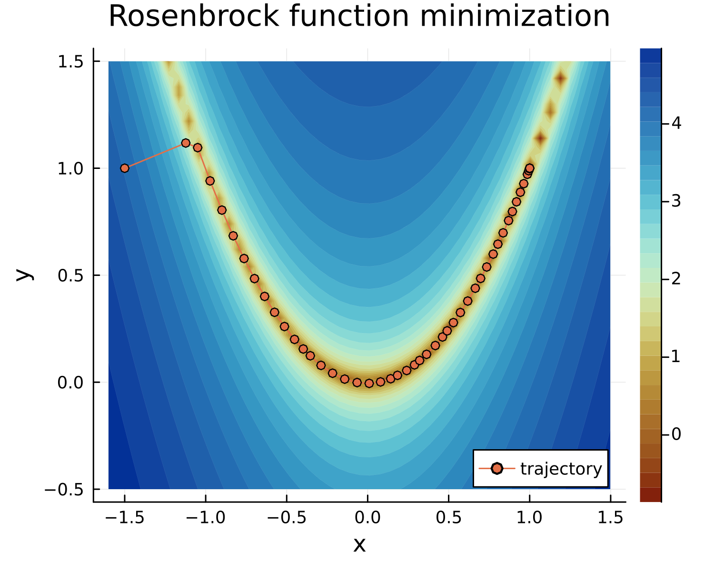
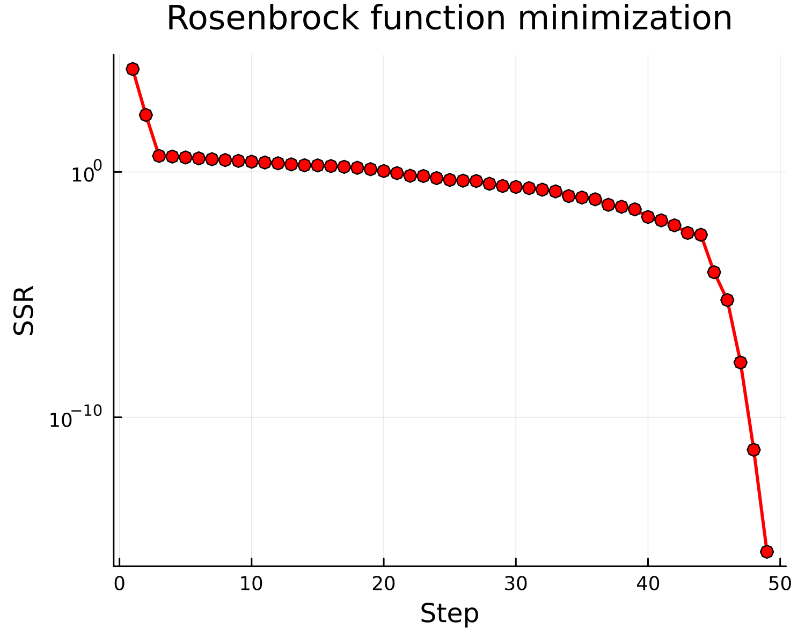

# `Fitty`

<!-- [](https://github.com/dododas/Fitty.jl/actions/workflows/CI.yml?query=branch%3Amain) --->

## Introduction

`Fitty` is a Julia package for data fitting with nonlinear least squares regression and bootstrap resampling to estimate parameter confidence intervals. `Fitty` currently provides the following features: 
- Unconstrained nonlinear least squares minimization using the Levenberg-Marquardt algorithm.  
  (A future version will add support for parameter bounds.)
- Forward mode automatic differentiation using `ForwardDiff.jl` to compute gradients
- A small number of user-friendly, well-documented functions for typical data fitting workflows
- Results contain optimizer trajectory in parameter space
- Tables of parameter estimates, standard errors and confidence intervals
- Built-in support for bootstrap resampling to estimate bootstrap parameter confidence intervals
- Multi-start optimization
- Utility functions for fitting commonly used models in biological/physical sciences, such as Michelis-Menten enzyme kinetics, Emax and Hill dose response functions, etc. 
- Jupyter notebooks with complete data fitting examples

`Fitty` is targeted toward scientists who work with experimental data and need a fast and reliable tool for data fitting and confidence interval. Relatively little Julia coding experience is needed beyond define your model and residuals as Julia functions.

## `Fitty` features

Below are some short demos of package features 

### Least squares minimization

`Fitty` implements the Levenberg-Marquardt algorithm that is accessible via the low level `LMfit()` function. The following code block uses this function to minimize the [Rosenbrock banana function](https://en.wikipedia.org/wiki/Rosenbrock_function):
$$ f(x, y) = (1 - x)^2 + 100 \cdot (y - x^2)^2 $$

that has a single global minimum at (1, 1) within a narrow valley. Below, this function is defined as a vector of two "residuals", such that the sum of the squared residuals is the Rosenbrock function that is minimized starting with an initial guess that is passed as input to `Fitty.LMfit()`.

```julia
julia> # Define Rosenbrock function
       Rosenbrock(θ) = [1 - θ[1], 100*(θ[2] - θ[1]^2)]
Rosenbrock (generic function with 1 method)

julia> # Minimize SSR starting with a non-optimal guess
julia> guess = [-1.5, 1]; # Starting guess away from global minima
julia> @time fit = Fitty.LMfit(Rosenbrock, guess);
Fit converged in 49 steps from intial guess [-1.5, 1.0]
Sum of squared residuals = 3.293e-16
Residual standard error = Inf
Parameters:
Table with 4 columns and 2 rows:
     Parameter  Guess  Estimate  StdErr
   ┌───────────────────────────────────
 1 │ θ₁         -1.5   1.0       Inf
 2 │ θ₂         1.0    1.0       Inf

  1.520819 seconds (6.19 M allocations: 414.373 MiB, 4.58% gc time, 99.09% compilation time)
```
The output reports estimated values of the two parameters, which is at the global minimum of the Rosenbrock function. Note that the estimated standard errors are reported to be `Inf` as there are 0 degrees of freedom in this problem (# of residuals = # of parameters). 

### Optimizer trajectory

The output of the optimizer contains the full trajectory starting from the initial guess provided by the user. The plots below show the trajectory of the optimizer in parameter space (LEFT) and the value of the Rosenbrock function on the right. 

 |  
---------- | --- 

### Data fitting with user-defined functions

This example uses the `Puromycin` dataset that reports the rate of an enzymatic reaction at different substrate concentrations. 

### Bootstrap confidence intervals

`Fitty.jl` implements bootstrap resampling to compute parameter confidence intervals


