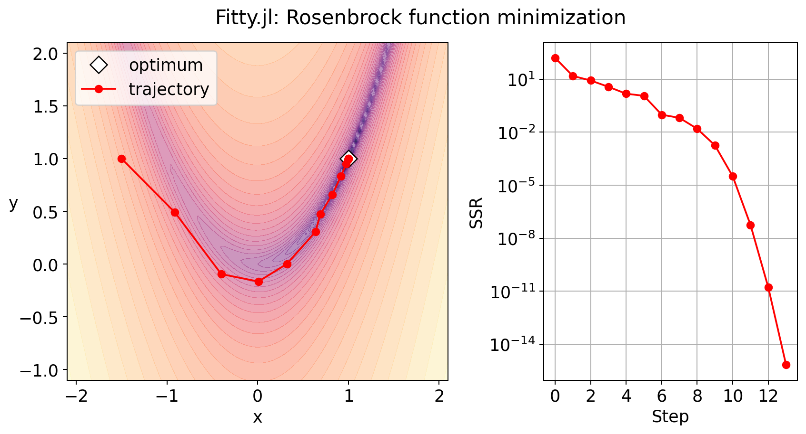
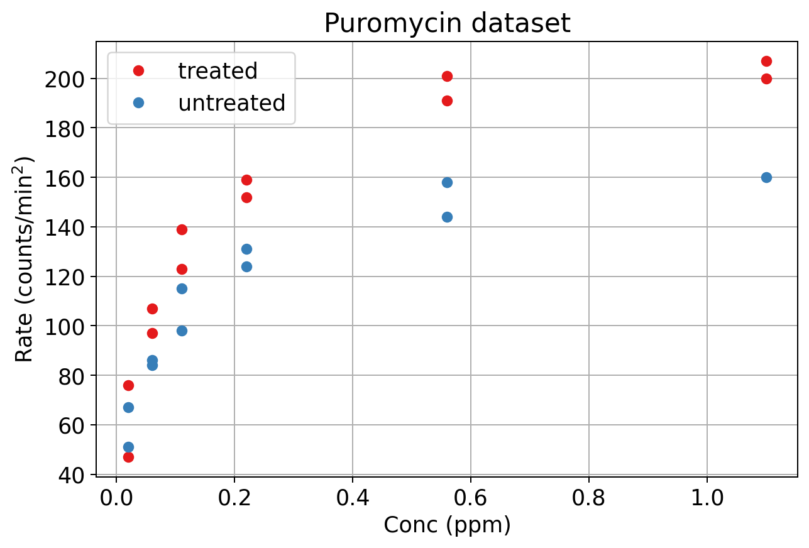
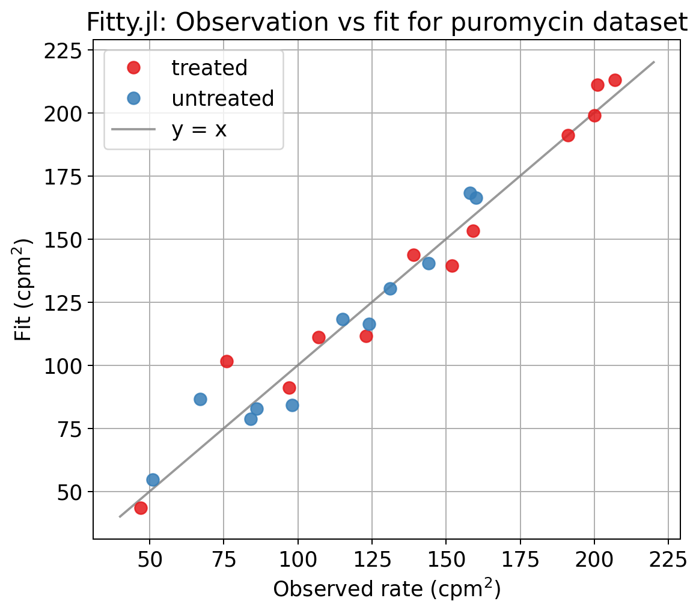
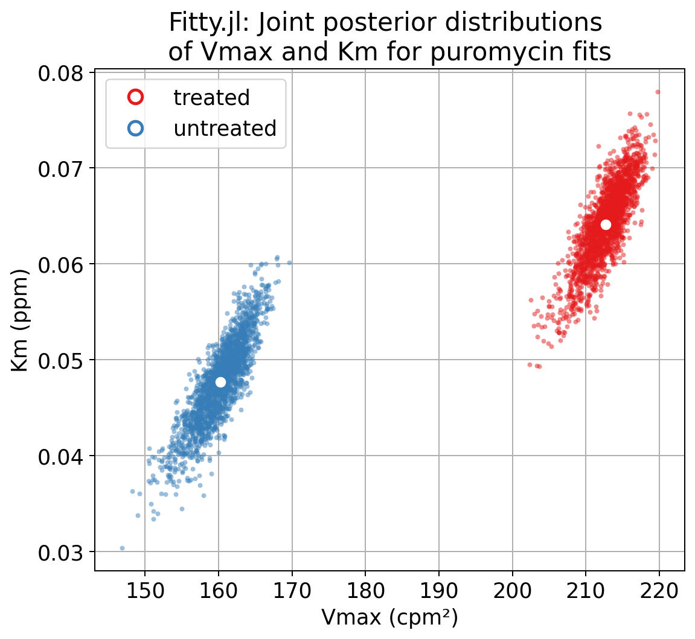

# `Fitty.jl`

`Fitty.jl` is a compact and fast Julia package for data fitting to mathematical models. It implements ordinary and weighted nonlinear least squares regression for parameter estimation, and Bayesian bootstrap to compute credible intervals (CIs). This repository contains the package source code and example Jupyter notebooks.  

## `Fitty.jl` features

`Fitty` currently provides the following features:  
- Ordinary and weighted nonlinear least squares fitting using a modern implementation of the 
- Parameter bounds
- Tables of parameter estimates, standard errors and confidence intervals using the standard normal approximation
- Bayesian bootstrap resampling to generate parameter posterior distributions and credible intervals (CIs)
- A small number of user-friendly, well-documented functions for typical data fitting workflows
- Results contain optimizer trajectory in parameter space
- Multi-start optimization
- Utility functions for fitting commonly used models in biological/physical sciences, such as Michelis-Menten enzyme kinetics, Emax and Hill dose response functions, etc. 
- Jupyter notebooks with complete data fitting examples

Under the hood, `Fitty` implements a trust region interior reflective method, which is a modern version of the well-known Levenberg-Marquardt algorithm with support for parameter bounds and several improvements for better convergence and numerical stability. Gradients are computed forward mode automatic differentiation provided by the `ForwardDiff.jl` package.

`Fitty` is targeted toward scientists who work with experimental data and need a fast and reliable tool for data fitting. confidence interval. Relatively little Julia coding experience is needed beyond define your model and residuals as Julia functions.

Below are some short demos of package features 

## Example 1: Quickstart - Minimizing the Rosenbrock function

The [Rosenbrock function](https://en.wikipedia.org/wiki/Rosenbrock_function) defined below is a common test problem for nonlinear least squares minimization:    
$$ f(x, y) = (1 - x)^2 + 100 \cdot (y - x^2)^2 $$
This function has a single global minimum at $x = y = 1$ that lies within a long, narrow and non-convex valley. Nonlinear least square algorithms can get stuck in the valley but not be able to converge to the minima. To minimize this function, first define a **residual function** that returns a vector of residuals:    
$$ \begin{pmatrix} \epsilon_1 \\ \epsilon_2 \end{pmatrix} = \begin{pmatrix} 1 - x \\ 10\cdot(y - x^2) \end{pmatrix} $$
for input value of $x$ and $y$. The sum of the squared residuals, SSR = $\epsilon_1^2 + \epsilon_2^2 = f(x, y)$ is the Rosenbrock function defined above. To minimize this SSR, pass the residual function and an initial guess as inputs to `Fitty.nlsfit()`, as shown below:    
```julia-repl
julia> # Define residuals for Rosenbrock function
       f(θ) = [1 - θ.x, 10*(θ.y - θ.x^2)]
f (generic function with 1 method)

julia> # Minimize SSR starting with a non-optimal guess
       guess = (x = -1.5, y = 1); # Starting guess away from global minima

julia> fit = Fitty.nlsfit(f, guess);
Fit converged in 13 steps from intial guess [-1.5, 1.0]
to final estimate [1.0, 1.0]
```
The optimal values of $x$ and $y$ are at the global minima of the Rosenbrock function. The output of the optimizer also contains the full optimizer history that is plotted below. The trajectory in parameter space is shown on the left and the value of the Rosenbrock function on the right.  
 

## Example 2: Data fitting with user-defined functions

This example uses the `Puromycin` dataset from the `RDatasets` package. These data report the rate of an enzymatic reaction at different substrate concentrations. The cells expressing the enzyme were either treated with puromycin or left untreated. The next code block loads this dataset and splits it into the two subsets:
```julia-repl
julia> # Load Puromycin dataset
       puro = dataset("datasets", "Puromycin")
23×3 DataFrame
 Row │ Conc     Rate   State
     │ Float64  Int32  Cat…
─────┼───────────────────────────
   1 │    0.02     76  treated
   2 │    0.02     47  treated
   3 │    0.06     97  treated
   4 │    0.06    107  treated
   5 │    0.11    123  treated
   6 │    0.11    139  treated
   7 │    0.22    159  treated
   8 │    0.22    152  treated
   9 │    0.56    191  treated
  10 │    0.56    201  treated
  11 │    1.1     207  treated
  12 │    1.1     200  treated
  13 │    0.02     67  untreated
  14 │    0.02     51  untreated
  15 │    0.06     84  untreated
  16 │    0.06     86  untreated
  17 │    0.11     98  untreated
  18 │    0.11    115  untreated
  19 │    0.22    131  untreated
  20 │    0.22    124  untreated
  21 │    0.56    144  untreated
  22 │    0.56    158  untreated
  23 │    1.1     160  untreated

julia> # Split into treated and untreated subsets
       data = Dict();

julia> for (s, df) in pairs(groupby(puro, :State))
           data[s.State] = df
       end

julia> data
Dict{Any, Any} with 2 entries:
  "untreated" => 11×3 SubDataFrame…
  "treated"   => 12×3 SubDataFrame…
```

The two subsets are plotted below:  


### Define model and fit each dataset

These data are fit with the Michelis Menten model that relates the reaction rate, $v$, to the substrate concentration, $c$:    
$$ v = \frac{V_{\text{max}} \cdot c}{K_m + c} $$

where $V_{\text{max}}$ is the maximal reaction rate, and the $K_m$ (Michelis constant) is the substrate concentration for half-maximal reaction velocity ($v = V_{\text{max}}/2$ when $c = K_m$). The next two code blocks show how to fit the two datasets to this model.

1. Define model and a residual function:  
```julia-repl
julia> # Michelis-Menten model
       model(θ, c) = @. θ.Vmax * c / (θ.Km + c);

julia> # Residual function
       residual(θ, df) = df.Rate - model(θ, df.Conc);

```

2. Pass residual function and an initial guess as input to `nlsfit()`.  
   Set lower bounds for the parameter estimates to 0 to constrain parameter estimates to biologically meaningful values.  
   Also set `bootstrap = true` to compute credible intervals (CIs):  
```julia-repl
julia> guess = (Vmax = 150, Km = 0.1);

julia> fitter(df) = Fitty.nlsfit(residual, guess, data = df, lb = 0, bootstrap = true);

julia> fits = Dict(t => fitter(df) for (t, df) in pairs(data));
Fit converged in 21 steps from intial guess [150.0, 0.1]
to final estimate [160.28, 0.048]
2000 bootstrap fits converged out of 2000 tries
Fit results: Table with 5 columns and 2 rows:
     Parameter  Bounds      Estimate   StdErr      CI
   ┌─────────────────────────────────────────────────────────────────────
 1 │ Vmax       [0.0, Inf]  160.28     6.48025     [153.725, 165.387]
 2 │ Km         [0.0, Inf]  0.0477082  0.00778187  [0.0387958, 0.0554922]
=========================================
Sum of squared residuals = 8.596e+02
Degrees of freedom = 11 - 2 = 9
Residual standard error = 9.773e+00
95.0% Bayesian credible intervals computed using 2000 bootstrap replicates
=========================================

Fit converged in 17 steps from intial guess [150.0, 0.1]
to final estimate [212.684, 0.064]
2000 bootstrap fits converged out of 2000 tries
Fit results: Table with 5 columns and 2 rows:
     Parameter  Bounds      Estimate   StdErr      CI
   ┌───────────────────────────────────────────────────────────────────
 1 │ Vmax       [0.0, Inf]  212.684    6.94716     [206.434, 217.104]
 2 │ Km         [0.0, Inf]  0.0641213  0.00828095  [0.054231, 0.071475]
=========================================
Sum of squared residuals = 1.195e+03
Degrees of freedom = 12 - 2 = 10
Residual standard error = 1.093e+01
95.0% Bayesian credible intervals computed using 2000 bootstrap replicates
=========================================
```
The output parameter tables for each fit report the best fit estimates, parameter standard errors and CIs. The sum of squared residuals at the fit, and the residual standard error are also reported. The best fit estimates can be used as inputs the model function to generate the fitted curves shown in the next plot:  


### Assess quality of fits

Fit outputs contain residuals that are plotted below.


The next plot shows the observed versus predicted values for the two fits, overlaid on the `y = x` line.  


### Compare parameter posterior distributions

`Fitty.jl` implements Bayesian bootstrap resampling to simulate parameter posterior distributions when the `bootstrap = true` option is set. These posteriors are used to compute the CIs reported in the fit outputs above. The plots below show the marginal distributions of the two parameters and their joint distribution for each fit:  
- Posterior distributions of $V_\text{max}$ show a clear separation between the two treatments:  
  
- In contrast, the distributions of $K_m$ show an overlap:
  
  Taken together, these distributions and the estimated CIs support the hypothesis that puromycin treatment affects the maximal velocity of the reaction but not the Michelis constant. 
- Finally, the joint posterior distribution shows the covariance between the two parameters for each treatment:
  

## More examples

The complete code for these two examples is in [this notebook](notebooks/01-IntroToFitty.ipynb)


